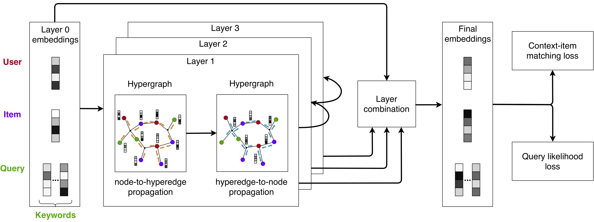

**Joint Personalized Search and Recommendation with Hypergraph Convolutional Networks**
======

## __Introduction__

This repository provides the source code for *Joint Personalized Search and Recommendation with Hypergraph Convolutional Networks* by Thibaut Thonet, Jean-Michel Renders, Mario Choi, and Jinho Kim. The implementation is based on PyTorch. More details about this work can be found in the original paper.

**Abstract:** Traditionally, the search and recommendation tasks are performed separately, by distinct models. Having a unique model for the two tasks is however particularly appealing for platforms that offer search and recommendation services to a shared user base over common items. In this paper, we study this unification scenario denoted as Joint Personalized Search and Recommendation (JPSR). To tackle this problem, we introduce HyperSaR, an hypergraph convolutional approach for search and recommendation. From the interaction data, we first build an hypergraph composed of user, item and query term nodes in which recommendation instances form user-item edges and search instances define user-item-query hyperedges. We then propagate user, item and query term embeddings using hypergraph convolution, and train HyperSaR with the combination of two complementary losses. The first one amounts to assessing the probability of an interaction, while the second one aims at predicting the query of a search interaction given a (user, item) pair. The proposed method is evaluated on the JPSR task using three datasets: a real-world, industrial dataset, and the public MovieLens and Lastfm datasets, which have been adapted to the task. Our experiments demonstrate the superior effectiveness of HyperSaR over competing approaches.

If you find this code useful, please consider citing us:

Thonet, T., Renders, J.-M., Choi M., & Kim J. (2022). **Joint Personalized Search and Recommendation with Hypergraph Convolutional Networks**. Proceedings of the 44th European Conference on IR Research.

## __Content of the repository__

The repository contains the following directories and files:

* The directory **preprocessing/** contains the code for preparing the datasets before running our program. It includes **preprocess_movielens.py** and **preprocess_lastfm.py**.
* The file **main.py** is the entry point of our program and is used to run the code for training and evaluation.
* The file **option_parser.py** defines the arguments of the program.
* The file **data_processing.py** contains the data processing code used in main.py.
* The file **data_loader.py** defines the datasets and collate functions used in the PyTorch data loader.
* The file **models.py** contains the classes implementing each model (HyperSaR and baselines used in the paper).
* The file **layers.py** contains the layers and atomic modules used in the models.
* The file **evaluation.py** implements the evaluation procedure.
* The file **utils.py** contains additional useful functions.
* The file **requirements.txt** indicates the Python libraries required to run the code.
* The file **LICENCE.txt** describes the licence of our code.
* The file **README.md**, which is the current file.

## __Required libraries__

The libraries required to run this code are indicated in the ``requirements.txt`` file. Using pip, the libraries can be simply installed using the following command:

	pip install -r requirements.txt

## __Preparing the data__

First, download the [MovieLens-25m](https://files.grouplens.org/datasets/movielens/ml-25m.zip) and [Lastfm](https://files.grouplens.org/datasets/hetrec2011/hetrec2011-lastfm-2k.zip) datasets from their original websites. Then extract the content of the zip files to ``data/movielens/`` and to ``data/lastfm/``, respectively. Finally, run the preprocessing code for each dataset which can be found in ``preprocessing/``:

	python preprocess_movielens.py
	python preprocess_lastfm.py

## __Getting the word embeddings__

Pretrained word embeddings are used in this code for running the JSR baseline. We adopted the 300-dimension [FastText](https://fasttext.cc/) embeddings. Download the English embeddings [here](https://dl.fbaipublicfiles.com/fasttext/vectors-crawl/cc.en.300.vec.gz) and extract them to the file ``w2v/cc.en.300.vec/raw_w2v``.

## __Running the code__

Running a model on a dataset, which comprises training and evaluation, is done through the following command:

	python main.py [-h] --dataset <str> --model <str> [--num_epoch <int>] [--batch_size <int>] [--eval_batch_size <int>] [--embed_dim <int>] [--edge_dropout <float>] [--weight_dropout <float>] [--weight_decay <float>] [--num_neg_sample <int>] [--num_layer <int>] [--num_keyword <int>] [--seed <int>] [--device_embed <str>] [--device_ops <str>] [--cuda <int>] [--num_workers <int>] [--use_valid] [--load] [--w2v_dir <str>] [--loss_weight <float>] [--lm_weight <float>]

The meaning of each argument is detailed below:

* ``-h``, ``--help``: Show usage.
* ``--dataset <str>``: Name of the dataset to use for the experiment.
* ``--num_epoch <int>``: Number of epochs. Default value: 100.
* ``--batch_size <int>``: Size of a minibatch. Default value: 1024.
* ``--eval_batch_size <int>``: Size of a minibatch at evaluation time. Default value: 128.
* ``--embed_dim <int>``: Dimension of the embeddings. Default value: 64.
* ``--lr <float>``: Learning rate of optimizer. Default value: 0.001.
* ``--edge_dropout <float>``: Probability of dropout for edges in the graph. Default value: 0.0.
* ``--weight_dropout <float>``: Probability of dropout for weight matrices. Default value: 0.0.
* ``--weight_decay <float>``: Weight of the L2 regularization. Default value: 0.0.
* ``--num_neg_sample <int>``: Number of negative sample items. Default value: 1.
* ``--num_layer <int>``: Number of layers for deep models. Default value: 1.
* ``--num_keyword <int>``: Maximum number of keywords to consider in the queries. Default value: 2000.
* ``--seed <int>``: Seed for reproducibility. Default value: 2019.
* ``--device_embed <str>``: Device on which the embeddings should be stored ("cpu" or "cuda"). Default value: "cuda".
* ``--device_ops <str>``: Device on which the operations should be performed ("cpu" or "cuda"). Default value: "cuda".
* ``--cuda <int>``: Index of the cuda to use (if gpu is used). Default value: 0.
* ``--model <str>``: Type of model to use (one of "MatrixFactorization", "LightGCN", "FactorizationMachine", "DeepFM", "JSR", "DREM", or "HyperSaR").
* ``--num_workers <int>``: Number of workers in the data loaders. Default value: 4.
* ``--use_valid``: Indicates whether to use the validation set for model selection.
* ``--load``: Indicates whether to load a previously trained model.
* ``--w2v_dir <str>``: Directory from which to load the pre-trained word embeddings for keywords (must be in ``w2v/``). Default value: 'cc.en.300.vec'.
* ``--loss_weight <float>``: Hyperparameter balancing the reconstruction/QL loss wrt the recommendation/CIM loss (for JSR/HyperSaR). Default value: 0.0.
* ``--lm_weight <float>``: Hyperparameter balancing the item-specific language model wrt the corpus language model (for JSR). Default value: 1.0.

For example, running the HyperSaR model on the lastfm dataset with the paper's hyperparameters (see below for a detailed list of the hyperparameters used in the experiments) is done with the following command:

	python main.py --dataset "lastfm" --model "HyperSaR" --num_layer 2 --edge_dropout 0.1 --loss_weight 0.001

When run, the code generates three files:

* A checkpoint of the model at the end of training (in ``checkpoint/ ``);
* A log of the training at each epoch (in ``log/``);
* A csv file containing the evaluation results (in ``res/``).

## __Hyperparameters used in the paper__

We detail here the hyperparameters used in the main experiments of the paper (Section 6.1). The hyperparameters shared across models and datasets are given in the table below:

| Hyperparameter | Value |
|---|---|
| num_epoch | 100 |
| batch_size | 1024 |
| embed_dim | 64 |
| lr | 0.001 |
| weight_decay | 0.0 |
| num\_neg\_sample | 1 |
| num_keyword | 2000 |

The remaining hyperparameters were obtained by a grid search (more details on the procedure in Section 5.3 of the paper) for each (model, dataset) pair. This resulted in the following dataset-specific hyperparameter values:

| Dataset | Model | Hyperparameter | Value |
|---|---|---|---|
| POI | LightGCN | num_layer | 2 |
| POI | LightGCN | edge_dropout | 0.3 |
| POI | DeepFM | num_layer | 1 |
| POI | DeepFM | weight_dropout | 0.1 |
| POI | JSR | num_layer | 0 |
| POI | JSR | weight_dropout | 0.0 |
| POI | JSR | loss_weight | 0.01 |
| POI | HyperSaR | num_layer | 2 |
| POI | HyperSaR | edge_dropout | 0.0 |
| POI | HyperSaR | loss_weight | 0.01 |
| MovieLens | LightGCN | num_layer | 3 |
| MovieLens | LightGCN | edge_dropout | 0.3 |
| MovieLens | DeepFM | num_layer | 3 |
| MovieLens | DeepFM | weight_dropout | 0.1 |
| MovieLens | JSR | num_layer | 3 |
| MovieLens | JSR | weight_dropout | 0.3 |
| MovieLens | JSR | loss_weight | 0.1 |
| MovieLens | HyperSaR | num_layer | 3 |
| MovieLens | HyperSaR | edge_dropout | 0.3 |
| MovieLens | HyperSaR | loss_weight | 0.01 |
| Lastfm | LightGCN | num_layer | 2 |
| Lastfm | LightGCN | edge_dropout | 0.1 |
| Lastfm | DeepFM | num_layer | 1 |
| Lastfm | DeepFM | weight_dropout | 0.2 |
| Lastfm | JSR | num_layer | 0 |
| Lastfm | JSR | weight_dropout | 0.0 |
| Lastfm | JSR | loss_weight | 0.01 |
| Lastfm | HyperSaR | num_layer | 2 |
| Lastfm | HyperSaR | edge_dropout | 0.2 |
| Lastfm | HyperSaR | loss_weight | 0.001 |